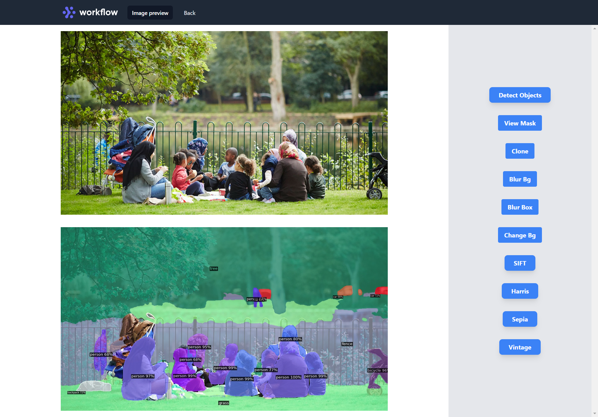

## Start With Detectron2
### For Windows
<br>

Download and Install Anaconda

Open Anaconda Prompt and create a new virtual environment by using the command:

```
conda create -n object_detect python=3.8
```

Activate the environment:

```
conda activate object_detect
```
Once done, install cython:
```
pip install cython
```
Install Pytorch and CUDA:
```
conda install pytorch torchvision torchaudio cudatoolkit=11.0 -c pytorch
```
Clone Detectron2 repository:
```
git clone https://github.com/facebookresearch/detectron2.git
```
Got to the downloaded repository folder:
```
cd detectron2
```
Install dependencies:
```
pip install -e .
```
Then install OpenCV:
```
pip install opencv-python
```

# Features

## Upload Image Here
<br>


## Editor
<br>


## Object Detection using detectron2
<br>



## select Interest mask
<br>


## Clone
<br>


## Blur Background
<br>


<br>


## Change Background
<br>


## SIFT
<br>


## HARRIS
<br>


## Sepia
<br>


## Vintage
<br>


<br>

```
Frontend => Tailwindcss, HTML
Backend  => FastAPI
Model    => detectron2
```
